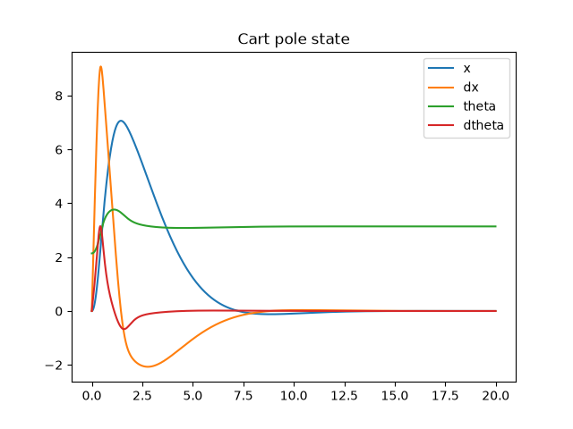
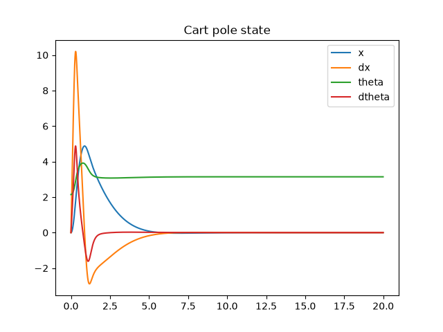

# Non-Linear Cart-Pole stabilization using Linear Quadratic Regulator

## Author
[Rebonato Aurélien] - Master in engineering and human movement science
[LinkedIn](www.linkedin.com/in/aurelien-rebonato-6617ab250)
[GitHub](https://github.com/rebonatoaurelien-create)

### Description
This project implements a physical simulation and an optimal control loop for an underactuated non-linear Cart-Pole system (inverted pendulum) entirely from scratch in modern C++.
This project features a custom implementation of the Linear Quadratic Regulator (LQR), including numerical linearization and a continuous algebraic Riccati Equation solver using a Runge-Kutta (RK4) integration scheme.
The system's dynamics has been inspired by the cart-pole dynamics described in Underactuated Robotics (Tedrake, 2024).


### Results




### Prerequisites
To build and run this project, you will need:
- A modern C++ compiler (supporting C++17)
- [CMake](https://cmake.org/) (>= 3.14)
- [Eigen3](https://eigen.tuxfamily.org/)
- Python 3 with `pandas` and `matplotlib` (for data visualization)

### Build Instructions
This project uses CMake for out-of-source builds.

```bash
# 1. Clone the repository
git clone [https://github.com/YourUsername/cartpole-lqr.git]
cd cartpole-lqr

# 2. Create a build directory and configure the project
mkdir build && cd build
cmake ..

# 3. Compile the C++ executable
make
```
### Run simulation instructions

```bash
python3 scripts/run_sim.py
```

### References

Russ Tedrake. Underactuated Robotics: Algorithms for Walking, Running, Swimming, Flying, and Manipulation (Course Notes for MIT 6.832).

